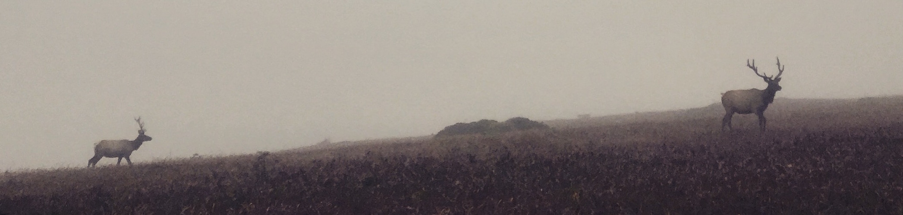

# Nature Notes

Partly inspired by [previous similar efforts](http://www.williamcronon.net/quotations.html), this is a collection of notes on texts having to do with nature in some way. There's a mix of quotations and my personal thoughts on the material. 

This document grew out of my teaching notes for a [Nature, Wilderness, and Conservation class](https://eveskew.github.io/assets/docs/Nature_Wilderness_Conservation_Syllabus.pdf), and large portions mirror the reading schedule from that course. Many of the questions throughout were intended to spur class discussion. I've significantly expanded those original notes with new material, and I hope that having this document as a public resource will motivate me to make additions more regularly. 

Many of the quotations here have been transcribed by hand, so do check the primary sources for accuracy before using.

---

---

### Terry Tempest Williams, *An Unspoken Hunger* (1994)

- "There is no such thing as waste except in the world of man." - pg. 8

- "I have felt the pain that arises from a recognition of beauty, pain we hold when we remember what we are connected to and the delicacy of our relations...Writing becomes an act of compassion toward life, the life we so often refuse to see because if we look too closely or feel too deeply, there may be no end to our suffering. But words empower us, move us beyond our suffering, and set us free. This is the sorcery of literature. We are healed by our stories." - pg. 57

- "What most humans really desire is really something quite different from industrial gimmickry—liberty, spontaneity, nakedness, mystery, wildness, wilderness."

  "What we need now are heroes and heroines, about a million of them, one brave deed is worth a thousand books. Sentiment without action is the ruin of the soul." - pg. 75-76 [quoting Edward Abbey]

- "The enterprise of conservation is a revolution, an evolution of the spirit." - pg. 87

- "He said the American psyche that wants war is the same psyche that doesn't want wilderness." - pg. 108 [referring to Peter Matthiessen]

- "Issues of peace and issues of the environment are rooted in a sacredness of life." - pg. 108 [quoting Peter Matthiessen]

- "I allow myself to struggle with the obligations of a public life and the spiritual necessity for a private one." - pg. 133

- "It just may be that the most radical act we can commit is to stay home." - pg. 134

- "And here: As Americans, we have always left when the land became degraded, moved on to the next best place. Walked west. Now, our continent is inhabited. There is no place left to go." - pg. 135

### Colson Whitehead, *The Colossus of New York* (2003)

- "Sleepless like rivers." - pg. 65

### Thomas Pynchon, *Vineland* (1990)

- "Someday this would be all part of a Eureka-Crescent City-Vineland megalopolis, but for now the primary sea coast, forest, riverbanks and bay were still not much different from what early visitors in Spanish and Russian ships had seen. Along with noting the size and fierceness of the salmon, the fogbound treachery of the coasts, the fishing villages of the Yurok and Tolowa people, log keepers not known for their psychic gifts had remembered to write down, for than once, the sense they had of some invisible boundary, met when approaching from the sea, past the capes of somber evergreen, the stands of redwood with their perfect trunks and cloudy foliage, too high, too red to be literal trees — carrying therefore another intention, which the Indians might have know about but did not share. They could be seen in photographs beginning at about the turn of the century, villagers watching the photographer at work, often posed in native gear before silvery blurred vistas, black tips of seamounts emerging from gray sea fringed in brute-innocent white breakings, basalt cliffs like castle ruins, the massed and breathing redwoods, alive forever, while the light in these pictures could be seen even today in the light of Vineland, the rainy indifference with which it fell on surfaces, the call to attend to territories of the spirit...for what else could the antique emulsions have been revealing?" - pg. 317

### Thomas Berry, *The Dream of the Earth* (1988)

- "Extinction is a difficult concept to grasp. It is an eternal concept...It is rather an absolute and final act for which there is no remedy on earth or in heaven. A species once extinct is gone forever." - pg. 9

- "Belief in a personal creative energy principle is the primary basis of Western spiritual tradition. Thus the creed opens with a reference to power as the distinguishing attribute of the creative principle of heaven and earth and all things. Unfortunately Western religious traditions have been so occupied with redemptive healing of a flawed world that they tend to ignore creation as it is experienced in our times. Consequently one of the basic difficulties of the modern West is its division into a secular scientific community, which is concerned with creative energies, and a religious community, which is concerned with redemptive energies. So concerned are we with redemptive healing that once healed, we look only to be more healed. We seldom get to our functional role within the creative intentions of the universe." - pg. 25

- "Without a fascination with the grandeur of the North American continent, the energy needed for its preservation will never be developed. Something more than the utilitarian aspect of fresh water must be evoked if we are ever to have water with the purity required for our survival. There must be a mystique of the rain if we are ever to restore the purity of the rainfall." - pg. 33

- "The mythic dimension, the sacred aspect of the Philippines, is needed if anything significant is to be done to remedy the devastation already present and to activate a program of renewal. Only in a viable natural world can there be a viable human world." - pg. 33

- "This task concerns every member of the human community, no matter what the occupation, continent, ethnic group, or age. It is a task from which no one is absolved and with which no one is ultimately more concerned than anyone else. Here we meet as absolute equals to face our ultimate tasks as human beings within the life systems of the planet Earth. We have before us the question not simply of physical survival, but of survival in a human mode of being, survival and development into intelligent, affectionate, imaginative persons thoroughly enjoying the universe about us, living in profound communion with one another and with some significant capacities to express ourselves in our literature and creative arts. It is a question of interior richness within our own personalities, of shared understanding with others, and of a concern that reaches out to all the living and nonliving beings of the earth, and in some manner out to the distant stars in the heavens...Even the most primitive tribes have a larger vision of the universe, of our place and functioning within it, a vision that extends to celestial regions of space and to interior depths of the human in a manner far exceeding the parameters of our own world of technological confinement." - pg. 37

- "It is a radical change in our mode of consciousness. Our challenge is to create a new language, even a new sense of what it is to be human. It is to transcend not only national limitations, but even our species isolation, to enter into the larger community of living species. This brings about a completely new sense of reality and of value." - pg. 42

- "At present, however, we are in that phase of transition that must be described as the groping phase. We are like a musician who faintly hears a melody deep within the mind, but not clearly enough to play it through. This is the inner agony we experience, especially when we consider that the music we are creating is the very reality of the universe." - pg. 47

- "The human community is passing from its stage of childhood into its adult stage of life. We must assume adult responsibilities." - pg. 47

- "Our tendency is to exalt the bright side of industry over the dark side of nature or to exalt the bright side of nature over the dark side of industry. In reality we need to compare bright with bright and dark with dark." - pg. 52

- "We all bear a certain amount of guilt for our present situation, since our American society has from its beginning supported the industrial process with enthusiasm. With few exceptions our society has considered the industrial route as the way into the future. We have been entranced with the progress myth, unlimited progress, progress that would lead beyond the existing human condition to something infinitely better, to wonderland. Such is the seductive theme of almost all our advertising." - pg. 57

- "Much of the assault that we perceive as natural is really human in origin. By cutting forests we invite floods; by practicing extensive monocultural agriculture, we invite pest infestation on a massive scale; by pouring chemicals on the land, we kill the soil and invite erosion. We could extend the list endlessly." - pg. 67

  - Emerging infectious diseases driven by anthropogenic activities are another prominent example

- "We might sometimes reflect and recall that the purpose of all our science, technology, industry, manufacturing, commerce, and finance is celebration, planetary celebration. That is what moves the stars through the heavens and the earth through its seasons. The final norm of judgment concerning the success or failure of our technologies is the extent to which they enable us to participate more fully in this grand festival." - pg. 69

- "Nor has the real situation been appreciated by social reformers or by those concerned with the needs of the poor and dispossessed. Whether socialist or capitalist in orientation, they wish mainly to assist the poor in finding their place in the industrial world. Whether privately or socially controlled, the industrial process itself is generally accepted. 

   Nor have our moral theologians been able to deal with our abuse of the natural world. After dealing with suicide, homicide, and genocide, our Western Christian moral code collapses completely; it cannot deal with biocide or geocide. Nor have church authorities made any sustained protest against the violence being done to the planet." - pg. 77

- "The industrial age itself, as we have known it, can be described as a period of technological entrancement, an altered state of consciousness, a mental fixation that alone can explain how we came to ruin our air and water and soil and to severely damage all our basic life systems under the illusion that this was "progress."" - pg. 82

- "The difficulty for government, for industry, and for the citizenry is accepting the consequences of the changes required, for we are involved in changes in the deep structure of our sense of reality and of value as well as in the practical adaptation to lifestyles less extravagant in their demands on the environment." - pg. 84

- "The universe is a communion and a community. We ourselves are that communion become conscious of itself." - pg. 91

- "The fruitful interaction between the scientific and the religious-humanist vision is our greatest promise for the future as well as the great task of the educator, both in comprehending for oneself and in communicating this vision to future generations of students." - pg. 101

- "The American experience can be presented in terms of enlightenment philosophy, post-Reformation Christianity, scientific competence, technological skill, commercial drive, and military might - all let loose on what might be the richest, most benign, surely one of the most beautiful and unspoiled, continents. After some four centuries of the American experience, we have before us a still beautiful and abundant land, but a land of roads and automobiles and grimy cities, a land of acid rainfall, polluted rivers and endangered species, a land extensively plundered of its forests and its mineral resources, a land with its human inhabitants somewhat bewildered and rebellious against their role as the great consumer people of earth." - pg. 109

- "Indeed, the American story has about it a magnitude and meaning that baffles all our efforts at understanding. Such power, such ideals of human freedom, such commercial cunning, such a sense of historical destiny - all are brought together in an attempt to bring the entire world into the millennial age." - pg. 110

- "The public spirituality is, I think, much more significant than the cultivated spirituality of marginal groups or individuals engaged in intensive prayer and meditation apart from the dynamics of the larger human community. Their lives and their guidance are of significant import for the human venture, but the ultimate spiritual issues are those dealt with in the cruel and compassionate world of active human existence, in the marketplace, in the halls of justice and injustice, in the places where the populace lives and works and suffers and dies." - pg. 110-111

- "On both sides, the scientific and the religious, there is a naiveté that is ruinous to the human community, to the essential functioning of the biosphere, and eventually disastrous to the earth itself.

   While the positive aspects of Western spirituality can be seen throughout the American experience, there are also the negative, alienating, and even destructive aspects of these same spiritual traditions. That traditional Western spiritualities have not enabled their followers to mitigate or even to understand or protest the terrifying assault of American society on the natural world is evidence of a certain incompetence or lack of understanding in these traditions." - pg. 112-113

- "When we inquire into the reasons for this inefficacy in our spiritual traditions, we might observe that our identification of the divine as transcendent to the natural world makes a direct human-divine covenant relationship possible, but also we negate the natural world as the locus for the meeting of the divine and the human. The natural world becomes less capable of communicating divine presence. This makes possible the conception of the natural world as merely external object." - pg. 113

- "Just as the doctrine of divine transcendence took away the pervasive divine presence to the natural world, so the millennial vision of a blessed future left all present modes of existence in a degraded status. All things were in an unholy condition. Everything needed to be transformed. This meant that anything unused was to be used if the very purpose of its existence was to be realized. Nothing in its natural state was acceptable." - pg. 115

- "That consumption has something sacred about it is obvious from the central position it now occupies. This is all quite clear from the relentless advertising campaigns designed to convince the society that there is neither peace nor joy, neither salvation nor paradise, except through heightened consumption." - pg. 115

	- Resonates strongly with the general themes of Don DeLillo's *White Noise*  

- "The sense of an untouched world, of primordial wilderness as divine presence to be left undisturbed by human interference, survived in a few persons such as Henry Thoreau and John Muir; but these were exceptional instances. Only such as these were aware that the diminishment of the grandeur and fertility of the natural world was not simply an economic loss, but also a weakening of the entire biosphere, elimination of the profound psychic experience, restriction of imaginative power, and ultimately the loss of unique modes of divine presence. Yet while Thoreau's and Muir's teachings were read with a certain respect, American determination to eliminate natural modes of being continued as the dominant attitude of the society." - pg. 115

- "The industrial-commercial mode of consciousness in our society has coexisted with a traditional spiritual coding in the pattern of Western classical spirituality. These two patterns cause little trouble to each other because neither the modern scientific mode of consciousness nor our spiritual consciousness is concerned with the integral functioning of the earth community. Indeed, both modes of consciousness experience the human as Olympian ruler of the planet, the planet as naturalistic functioning, and earth's resources as objects for unlimited human exploitation." - pg. 119

- "Overattachment to the salvific role of our spiritual traditions seems to prevent any serious inquiry into a creation-oriented spirituality within the context of our present mode of experiencing the universe." - pg. 122 

- "Even with advanced science and technology, with superb techniques in manufacturing and commerce, in communications and computation, our secular society remains without satisfactory meaning or the social discipline needed for a life leading to emotional, aesthetic, and spiritual fulfillment. Because of this lack of satisfaction many persons are returning to a religious fundamentalism. But that, too, can be seen as inadequate to supply the values for sustaining our needed social discipline." - pg. 124

- "This Christian redemptive mystique is little concerned with the natural world. The essential thing is redemption out of the world through a personal savior relationship that transcends all such concerns. Even the earlier mystical experiences of ascending to the divine through the realms of created perfection are diminished." - pg. 129

  - Aligns with Marcus Borg's assertion (in *Convictions*) that to view the importance of Jesus' life purely as a redemptive sacrifice (i.e., substitutionary atonement) is a mistake. This is in contrast to a perspective that focuses on the things Jesus said, did, and the example he provides for a moral and ethical life 
  
- "The human venture remains stuck in its impasse. Children who begin their earth studies or life studies do not experience any numinous aspect of these subjects. The excitement of existence is diminished. If this fascination, this entrancement, with life is not evoked, the children will not have the psychic energies needed to sustain the sorrows inherent in the human condition. They might never discover their true place in the vast world of time and space. Teaching children about the natural world should be treated as one of the most important events in their lives. Children need a story that will bring personal meaning together with the grandeur and meaning of the universe. The secular school as presently constituted cannot provide the mystique that should be associated with this story. Nor can the religious-oriented school that has only superficially adopted this new story of the universe evoke this experience in the child." - pg. 130-131

- "The believing redemption community is awakening only slowly to this new context of understanding. There is a fear, a distrust, even a profound aversion, to the natural world and all its processes. It would be difficult to find a theological seminary in this country that has an adequate program on creation as it is experienced in these times. The theological curriculum is dominated by a long list of courses on redemption and how it functions in aiding humans to transcend the world, all based on biblical texts. Such a situation cannot long endure, however, since a new sense of the earth and its revelatory import is arising in the believing community. The earth will not be ignored, nor will it long endure being despised, neglected, and mistreated. The dynamics of creation are demanding attention once more in a form unknown for centuries to the orthodox Christian." - pg. 133-134

- "It is somewhat fascinating to realize that the final achievement of our scientific inquiry into the structure and functioning of the universe as evolutionary process is much closer to the narrative mode of explanation given in the Bible than it is to the later, more philosophical mode of Christian explanation provided in our theologies." - pg. 136

  - Reminiscent of: "For the scientist who has lived by his faith in the power of reason, the story ends like a bad dream. He has scaled the mountains of ignorance; he is about to conquer the highest peak; as he pulls himself over the final rock, he is greeted by a band of theologians who have been sitting there for centuries." - Robert Jastrow, *God and the Astronomers* (1978)
  
- "The main determinant of reality and value in Western civilization was expressed in the belief structures presented by the church. These in turn were determined by the divine revelation contained in the Bible and in the living tradition, both subject to church interpretation. Here is the deepest source and support for the patriarchal tradition of Western civilization. It is also the most profound challenge in terms of the reversal taking place in our understanding of reality and value. The sense of the sacred in any civilization is precisely that which cannot be questioned, for the sense of the sacred is the unquestionable answer to all questions. Thus the psychic shock in the reassessment that is presently being made." - pg. 149

- "In the Bible narrative, woman becomes the instrument for the entry of evil into the world and for the breakdown in human-divine relations. Only in a derivative sense, through their association with men, do women function in the public life of the sacred community. Later, in explanation of the lesser quality of female being, women are seen as biologically the consequence of some lack of vigor in the male component of the conception process, since in its full energy conception should produce a male child. In this context the whole of feminine existence becomes profoundly diminished as a mode of personal being." - pg. 150

- "Through advertising the corporation has gained control over the public media. Through the public media the corporation controls the deepest psychic as well as the most powerful physical forces of the planet." - pg. 156

- "The difficulty with our industrial wonderworld is that its products last for a brief period and then forever remain as a trashed and toxic world in which we and all future generations are condemned to live for an indefinite period. Like the illusion of a magician, we are presented with the blissful moment in the use of these inventions, with no indication of their abiding dark aspect. Human productions do not consistently renew themselves in the manner of natural forms." - pg. 157

- "The change indicated is the change from an exploitive anthropocentrism to a participative biocentrism. The change requires something beyond environmentalism, which remains anthropocentric while trying to limit the deleterious effects of human presence on the environment." - pg. 168-169

- "What we seem unwilling or unable to recognize is that our entire modern world is itself inspired not by any rational process, but by a distorted dream experience, perhaps by the most powerful dream that has ever taken possession of human imagination. Our sense of progress, our entire technological society, however rational in its functioning, is a pure dream vision in its origin and in its objectives. This dream vision of the coming Day of the Lord, as mentioned by the prophets, was taken up by Daniel in his interpretation of the apocalyptic dream of Nebuchadnezzar. Although this entrancing vision of the universe was originally presented as the spiritual triumph of the divine kingdom, it was later described by John the Evangelist as a blissful period beyond the human condition, to be experienced within the historical order prior to the ultimate transference of the kingdom to its celestial setting...That very rational process that we exalt as the only true way to understanding is by a certain irony discovered to be itself a mythic, imaginative dream experience." - pg. 205

- "The difficulty is that this dream of a millennial transformation to be achieved by science and technology under the direction of the modern corporation is thought of as the singular reality controlling all things and giving meaning to the whole of history. This vision alone makes life worthwhile. That is why the millennial vision is so important to the advertising industry, with its projection of a paradise that can be obtained through product consumption, any product.

   When the absurdity of progress through exponential growth was indicated a few years ago in a work entitled *The Limits to Growth*, a general outcry could be heard across the country. That outcry was more than a justified criticism of the specific data or the time scale of future events. It was resentment against the indication that the dynamism of our consumer society was the supreme pathology of all history." - pg. 206
   
- "His [Paul Ehrlich's] final suggestion was that "scientific analysis points, curiously, toward the need for a quasi-religious transformation of contemporary cultures."" - pg. 207

- "Both Huxley and Freud saw the human as essentially alien to the larger community of creatures. The basic need was to subject the natural world to the human lest the human become subjected to and possibly destroyed by the natural world. In this context it is easy to understand the attitude that other earthly beings are instruments to be used or resources to be exploited for human benefit. We are too good for the natural world. In ourselves the natural world goes beyond itself into a new and more sublime form of grandeur. Neither Huxley nor Freud had any idea of the disastrous consequences of such an attitude on the integral functioning of the earth or on our human destiny." - pg. 209

- "Our spiritual values are disorientating with their insistence on the flawed nature of the existing order of things and the need for relief by escape from the earth rather than on a greater intimacy with the earth. Constantly we assert the value of the human over the merely resource values of the natural world. Our legal system fosters a sense of the human as having rights over the rights of natural beings. Our commerce, industry, and economics are based on the devastation of the earth. Disengagement from such basic life commitments requires a certain daring." - pg. 210

- "If the supreme disaster in the comprehensive story of the earth is our present closing down of the major life systems of the planet, then the supreme need of our times is to bring about a healing of the earth through this mutually enhancing human presence to the earth community. To achieve this mode of pressure, a new type of sensitivity is needed, a sensitivity that is something more than romantic attachment to some of the more brilliant manifestations of the natural world, a sensitivity that comprehends the larger patterns of nature, its severe demands as well as its delightful aspects, and is willing to see the human diminish so that other lifeforms might flourish." - pg. 212

- "Until the human is understood as a dimension of the earth, we have no secure basis for understanding any aspect of the human. We can understand the human only through the earth." - pg. 219

### Anthony Bourdain

- "If I’m an advocate for anything, it’s to move. As far as you can, as much as you can. Across the ocean, or simply across the river. The extent to which you can walk in someone else’s shoes or at least eat their food, it’s a plus for everybody. Open your mind, get up off the couch. Move."

### Gary Snyder in [*The Paris Review*](https://www.theparisreview.org/interviews/1323/gary-snyder-the-art-of-poetry-no-74-gary-snyder) (1996)

- "For those who can do it, one of the things to do is not to move. To stay put. Now staying put doesn't mean don't travel. But it means have a place and get involved in what can be done in that place. Because without that we're not going to have a representative democracy that works in America. We're in an oligarchy right now, not a democracy. Part of the reason that it slid into oligarchy is that nobody stays anywhere long enough to take responsibility for a local community and for a place."

### Don DeLillo, *Mao II* (1991)

- "Think of the future and see how depressed you get. All the news is bad. We can't survive by needing more, wanting more, standing out, grabbing all we can." - pg. 89

### Karl Ove Knausgaard, *Autumn* (2015)

- [on plastic bags from the chapter “Plastic Bags”] “But it felt good to look at it, the way it feels good to read a poem that ends in an image of something concrete and seems to fasten on it, so that the inexhaustible within it can unfold calmly”

  - This is a great description of much of haiku and imagist poetry that seeks to find something deep in concrete images, often derived from the natural world. 
  
  - It’s also a good description of this book, which often addresses simple, material things like plastic bags. 
  
  - Finally, the plastic bags themselves strike me as a very ironic image. Plastic bags are clearly artificial and unnatural in one sense. And they have well known negative environmental impacts. However, through his description, Knausgaard finds something inherently “natural” about a plastic bag floating in the water. It has its own quiet beauty, and, due to its permanence, is an ironic symbol of what many people seek in nature: a sense of grounding, something constant, unchanging, and timeless.
	

### Ralph Waldo Emerson, *[Nature](http://transcendentalism-legacy.tamu.edu/authors/emerson/nature.html)* (1836)

- Poet and essayist with transcendental ideas
	
	- Believed humans were capable of a direct experience of the divine
	
	- Nature often a path for this sort of revelation
	
- Transcendentalism: philosophical movement that maintained the inherent goodness of people and nature

  - Emphasized the purity of independent individuals

  - Walt Whitman's “[When I Heard the Learn’d Astronomer](https://www.poetryfoundation.org/poems/45479/when-i-heard-the-learnd-astronomer)” is an interesting example that contrasts scientific and aesthetic/intuitive experiences of nature

- Champion of individualism and individual experience
	
	- Does this create a problem for conservation? After all, conservationists are usually concerned with preserving nature for some greater good rather than for their own personal use or happiness
	
	- Could be seen to lead to our desire to use and experience nature in order for it to have value

- What exactly is the nature Emerson is describing?

  - Seems to be more like the nature of things in the universe, but sometimes it is nature in the sense of the outdoors as it is commonly used

- Nature is a place for delight and spiritual renewal

  - Emerson sees nature as something entirely apart from and largely unchanged by man

- “Nature never wears a mean appearance”

  - A very rosy view of nature

- “In the wilderness, I find something more dear and connate than in streets or villages.”

  - Have people always felt this way? Doubtful. For much of human history, people have been trying to escape the hardship of nature rather than return to it. The transcendentalists are in part responsible for a shift back towards nature.
  
- Commodity: "the only use of nature which all men apprehend"
	
	- A foreshadowing of ecosystem services arguments for conservation
	
	- Emerson suggests nature has a much greater use than that though: “A man is fed, not that he may be fed, but that he may work.”

- Outlines an aesthetic value of nature

### John Muir 1876, [God’s first temples](https://scholarlycommons.pacific.edu/cgi/viewcontent.cgi?article=1021&context=jmb)

- Like Emerson, values nature for its intrinsic beauty, as a place of worship and renewal

  - Advocating for the protection of specific places because of their aesthetic worth

- Starts with the assumption that we can in fact destroy our natural resources beyond repair

- Foreshadows ecosystem service arguments with the reference to flood control, etc.

- References species that may already been on their way out
	
	- Should we spend the effort trying to save them?

- Gets at issues related to human vs. natural disturbances and the temporal differences between them (i.e., human changes are usually very fast, natural ones slower) 

### John Muir 1912, [Hetch Hetchy Valley](https://vault.sierraclub.org/john_muir_exhibit/writings/the_yosemite/chapter_16.aspx)

- What is the history of Hetch Hetchy Valley?
	
	- Dammed for water resources for San Francisco
	
	- Illustrates the fact that environmental destruction and use of the resource may be spatially incongruous

- He calls it a "precious mountain temple" – demonstrating his religiosity

- What’s his view on commercial use of nature?
	
	- Seemingly very negative
	
	- Makes references to the New and Old Testament (the Temple and the Garden of Eden) as places where human greed has spoiled something good

### Aldo Leopold 1949, [The land ethic](http://oregonstate.edu/instruction/phl201/modules/texts/text3/leopold.html)

- The idea of the land ethic is Leopold’s primary intellectual contribution to conservation

- What is the land ethic?

  - “The land ethic simply enlarges the boundaries of the community to include soils, waters, plants, and animals, or collectively: the land.”

- How is this different from Muir’s vision?
	
	- Potentially more holistic, considers an ecological community rather than a particular species or place, more focused on processes 

- Suggests we need an overhaul in worldview and values to enact conservation, not simply more lip service given to incremental legislation, etc.

- People are motivated by short-term, individual benefit
	
	- Is this something that we have to change to "do conservation?"
	
	- Claims land-use ethics are still governed by self-interest, whereas we commonly acknowledge that social ethics must aim to satisfy higher moral causes

- "In our attempt to make conservation easy, we have made it trivial."

- "Health is the capacity of the land for self-renewal. Conservation is our effort to understand and conserve this capacity."

  - Very forward-looking in its concern for ecological processes rather than particular ecological states

### John Muir 1916, [Cedar Keys](http://www.sierraclub.org/john_muir_exhibit/writings/a_thousand_mile_walk_to_the_gulf/chapter_6.aspx)

- Ends with a rumination on people who, influenced by religion, view everything on Earth as put there for their consumption and use

- Muir argues that nasty things in nature prove this isn’t true and that we should instead view ourselves as one part of a whole rather than the focus around which everything else revolves

### John Muir 1920, [Save the redwoods](http://www.sierraclub.org/john_muir_exhibit/writings/save_the_redwoods_1920.aspx)

- In the first paragraph he imagines a skinned, dying sequoia tree quoting Jesus from the New Testament

  - Reinforces his religious view of nature and puts the human destruction of nature on the same level as the crucifixion of Jesus

- He also seems to suggest that if everyone could see the glory of nature it would suffer no loss of defenders

  - He apparently was under the belief that nature would be protected for its existence value if this value was more widely known

### Cronon 1998, [The trouble with wilderness, or getting back to the wrong nature](https://www.williamcronon.net/writing/Cronon_Trouble_with_Wilderness_1995.pdf)

- References a shift in cultural usage of wilderness as a term
	
	- I think it’s still a fair question to ask how different groups of people think about “wilderness.” Is it a positive or negative thing for them?

- Is wilderness totally a human construct or does it actually exist?
	
	- Some argue it does not because of climate change and other pervasive human impacts on the environment that range even into the poles and deep oceans

- The two reasons he outlines for the shift towards a more romantic view of wilderness are the sublime and the frontier

- What’s Cronon’s point in writing this essay? What do we gain from it?
	
	- An awareness of our presuppositions
	
	- These presuppositions still have an effect on what we value (i.e., mountains, glacial landscape, waterfalls, but generally not swamps or grasslands)
	
	- These presuppositions probably still strongly influences conservation attitudes today (i.e., conservationists want to preserve the “purity” of a landscape by removing people from it)

- Cronon’s descriptions of Wordsworth and Thoreau suggest that the first impetus for conservation arose from individual concerns (i.e., these people would want to conserve nature because of the awe-inspiring personal experiences they had within it)
	
	- When did this shift to more pragmatic views (i.e., ecosystem services) and take on a greater community context?

- Is wilderness a national concept? Should we expect other cultures to differ in their conception of wilderness?

- What issues are lurking behind the idea of us conquering the frontier?
	
	- Ignoring or downplaying different indigenous peoples, the roles of women, class issues, etc.

- Wilderness was a place for recreation and consumption

- We have to acknowledge that the frontier was actually already inhabited when westerners came to it
	
	- In fact, Native Americans probably settled the western portions of North America first
	
- “The romantic ideology of wilderness leaves precisely nowhere for human beings actually to make their living from the land.”

- Many conservationists uphold wilderness as their ideal, but are we truly ready to make the leap to everything being wilderness? Are we really advocating for returning to prehistoric conditions? If not, what are we advocating for? The park preservation model as it is now? Something new entirely?

- “Without our quite realizing it, wilderness tends to privilege some parts of nature at the expense of others.”

- Wilderness articulates “deep mom values”

- “If living in history means that we cannot help leaving marks on a fallen world, then the dilemma we face is to decide what kinds of marks we wish to leave.”

### Grove 1990, [The origins of environmentalism](https://doi.org/10.1038/345011a0)

- Seems to assume that modern environmental attitudes were invented by Europeans and North Americans

- Europeans only recognized the significance of environmental change when it happened to their colonial lands?
	
	- A result of shifting baseline syndrome? I.e., Europe was degraded slowly, so the extent of the degradation was never very noticeable. In contrast, Europeans were able to cause severe, rapid destruction of relatively pristine colonial environments, making their impacts very apparent. Potential example of an entire region (western Europe) suffering from shifting baseline syndrome

  - The colonial lands served as an analog to Cronon’s “wilderness” concept for Europeans?

- What was the primary motivation for environmental concern during colonialism? 
  
  - Grove argues it’s economics

### Guha 2000, [The paradox of global environmentalism](http://www.vedegylet.hu/okopolitika/Guha%20-%20The%20Paradox%20of%20Global%20Environmentalism.pdf)

- What’s the distinction between environmentalism and conservation?

- “While saving these islands of biodiversity, American environmentalists have paid scant attention to what was happening outside them. This was especially apparent in their indifference to America’s growing consumption of energy and materials.”
	
	- Resonates with Cronon’s essay

- The wilderness ideal in foreign countries is based on the assumption that ALL human intervention is a negative influence on biological diversity

- Does the responsibility for conservation of biological diversity fall on local inhabitants or is it global?
	
	- What about the biological resources? This seems to me a more local issue

- What strategies might we use to resolve these imperialistic conflicts?
	
	- Maybe focus on reducing overconsumption in Western countries, encouraging cooperative management of parks in conjunction with local peoples 

### Lenzen et al. 2012, [International trade drives biodiversity threats in developing nations](https://doi.org/10.1038/nature11145)

- Ties in nicely with the ideas of Guha 2000: developed countries, through their economic behaviors, drive threats to species in developing nations

### Diamond 1986, [The environmentalist myth](https://doi.org/10.1038/324019a0)

- Again islands are a major source of our biological knowledge

- An example of environmental destruction leading to societal collapse

### Hames 2007, [The ecologically noble savage debate](https://doi.org/10.1146/annurev.anthro.35.081705.123321)

- Pleistocene overkill may be a very notable example of native impacts on the environment

- What’s the importance of epiphenomenal conservation?
	
	- “Sustainability was not by design”

- What are the issues involved in objectively judging native ecological attitudes?
	
	- The effects of contact with westerners

- Diamond’s *Collapse* suggests that conservation is not always an option (the environment may just be too inhospitable or other concerns, like survival, may take precedence)

- Is consciousness necessary for conservation?
	
	- The paper suggests conservation can happen without an appropriate consciousness of ecological dynamics, but I’d say it would sure help to have that

### Redford and Sanderson 2000, [Extracting humans from nature](https://doi.org/10.1046/j.1523-1739.2000.00135.x)

- Land uses of natives likely have a smaller effect than other, competing uses

- Their existence in these places is going to necessitate their use of the environment, but that doesn’t mean they can’t serve as allies of conservation

### Papworth et al. 2009, [Evidence for shifting baseline syndrome in conservation](https://doi.org/10.1111/j.1755-263X.2009.00049.x)

- Generational amnesia refers to successive generations being unfamiliar with the conditions of the past whereas personal amnesia refers to individuals believing current conditions have been long-established even if they experienced something differently in their own past

- What is shifting baseline syndrome (SBS)? What are the two distinct types?
	
- What are the problems with demonstrating SBS?
	
	- Data from old sources (i.e., journals or diaries) may be biased, exaggerated, or not quantitative
	
	- In addition, this data often refers only to the biological system not the human perception of the system;	need both biological data demonstrating change and information on observer perceptions of change to establish SBS

- Can you think of better ways to study SBS?
	
	- One study covered in the paper showed good evidence for generational amnesia in perception of relative abundance of birds
	
	- Seems to be yet another case where broad-scale wildlife monitoring would help us address biological management problems

- Does acknowledging SBS actually matter that much? In what situations? How would we effectively combat SBS?
	
	- It may be important to have people from different groups (i.e., hunters, foresters, farmers, fishermen) communicate with each other rather than hitting them over the head with biological data

### Willis and Birks 2006, [What is natural? The need for a long-term perspective in biodiversity conservation](https://doi.org/10.1126/science.1122667)

- What applications are long-term ecological data most useful for?
	
	- There are major implications for invasive species. If they’re deemed to be non-native despite being established for a long period of time, they may not get the benefit of needed protections

- How far back does “human" activity extend?

  - Multiple examples here of human activity extending beyond hundreds of years ago

- And in some cases, the human activities appear to have contributed to the current conservation value of the habitats

- What’s the value of maintaining individuals in the “rear-edge region” of a population?

- What types of data are used in making inferences about historical ecological conditions?
	
	- They combine the use of so-called “paleoecological data” and genetic data

- How do we communicate shifting baselines most effectively? 

### Donlan and Martin 2004, [Role of ecological history in invasive species management and conservation](https://doi.org/10.1111/j.1523-1739.2004.00101.x )

- “From a management perspective, our benchmarks dictate who is native and who is not.”

### Donlan et al. 2005, [Re-wilding North America](https://doi.org/10.1038/436913a)

- What are the benefits of this vision of conservation? Does it matter how practical it is?
	
  - It at least offers a positive take on conservation

- Does it matter if we did the ecological damage in the first place?
	
  - The authors seem to argue for re-wilding partially based on the idea that ancient humans contributed to megafaunal extinctions. But what if we take this to its logical conclusion? Are we to mitigate for every human impact? What if we want to change an ecosystem into a state that would not be strict restoration?

- Is 13,000 years ago less of an arbitrary conservation baseline than 1492?

- Do you think these Pleistocene parks would have significant economic value?

- Are there potential costs to moving these megafaunal species to North America?

  - Many ecological interventions face the objection that they may have unforeseen consequences. How do we weigh decisions in these cases? When do we abandon the precautionary principle?

- “We want to reinvigorate wild places”

  - Interesting in the sense that “wild” often implicitly means a place that is devoid of human influence

- What do you think the general public reaction to Pleistocene re-wilding would be?

### Caro 2007, [The Pleistocene re-wilding gambit](https://doi.org/10.1016/j.tree.2007.03.001)

- Do we need to know the complete species composition of ancient North America to attempt Pleistocene re-wilding?
	
	- I don’t think so. We’ll probably never know the exact ecological history, and in any case, part of the goal of Pleistocene re-wilding is to help preserve extant species that we know are in trouble

- Brings up the point that Pleistocene re-wilding could siphon conservation funds from the Old World

- Interesting point brought up near the end: is conservation actually a better bet in North America than some other third world countries? Tanzania (among others) seems to be doing conservation well at home

- Is conservation all doom and gloom?
	
	- This strategy might allow us to garner more support (and funding) for conservation

### Oliveira-Santos and Fernandez 2010, [Pleistocene rewilding, Frankenstein ecosystems, and an alternative conservation agenda](https://doi.org/10.1111/j.1523-1739.2009.01379.x)

- Is it likely that re-wilded large megafauna could become invasive?

  - I’m not aware of many examples of invasive megafauna. Seems like they’d be easily to track down and control. Isn’t that exactly why many are extinct or endangered in the first place?
  
- Is the point of Pleistocene re-wilding to recreate lost ecological interactions or to encourage (potentially novel) evolutionary processes?

### Toledo et al. 2011, [The shifting of ecological restoration benchmarks and their social impacts: digging deeper into Pleistocene re-wilding](https://doi.org/10.1111/j.1526-100X.2011.00798.x)

- What is the ultimate goal of conservation: maintenance of ecological or evolutionary processes?

- Criticizes benchmarks for conservation based on “pristine” nature in much the same way that William Cronon does

- Seems like there are two levels of debate: is Pleistocene re-wilding sound from an ecological and evolutionary conservation standpoint, and is it sound from a contemporary social and cultural standpoint?

### Barlow 1999, [Rewilding for evolution](https://www.researchgate.net/publication/288668913_Rewilding_for_Evolution)

- Good quotes from Dave Foreman about how the goal of rewilding (in the broad sense) is to ensure that evolutionary processes can continue unabated

### Fullerton and Stavins 1998, [How economists see the environment](https://doi.org/10.1038/26606)

- First theorem of welfare economics allows you to identify situations where a free market solution will not be found (similar to how Hardy-Weinberg can tell you when a population is undergoing evolution by clarifying the conditions under which no evolution would be expected)

- What are the benefits of using market costs?

  - They reveal how society actually values a resource

- How might we evaluate value? What are the problems with these methods?

- Money is simply a medium of exchange, a metric for value

### McCauley 2006, [Selling out on nature](https://doi.org/10.1038/443027a)

- Argues for “ethics and aesthetics” over economics in conservation

- Proponents of ecosystem service arguments propose them as win-win scenarios

  - But how do we argue economically for species that harm us or have no positive or negative effects?

- Real markets are subject to rapid flux

- Are we really gradually replacing nature’s services with technology?

### Armsworth et al. 2007, [Ecosystem-service science and the way forward for conservation](https://doi.org/10.1111/j.1523-1739.2007.00821.x)

- “Nature for nature’s sake resonates only with the already converted.” 

  - Is this true?

- Do ecosystem-service arguments help prevent the artificial separation of humans from nature that writers like Cronon see as problematic?

- Which audiences do you think ecosystem-service arguments would be most effective for?

### Mandel et al. 2010, [A derivative approach to endangered species conservation](https://doi.org/10.1890/070170)

- What do they mean in saying stakeholder interests and the law are not aligned?

- What’s the basic concept of a derivatives market? How was that illustrated with the catastrophe bonds?

- Who is needed to carry out monitoring and censuses under such a scheme?

- Where would investors be likely to put their money under such a scheme?
	
  - Would it really help if investors just go for the safest bets and therefore invest in the species that are actually at the lowest risk for extinction?

- Do you think the benefits of a derivative scheme outweigh the various risks and problems that the authors outline?

### Jachowski and Kesler 2009, [Allowing extinction: should we let species go?](https://doi.org/10.1016/j.tree.2008.11.006)

- Should we use every resource available to keep species extant even if their populations are small and of little ecological significance?
	
  - If we really think that keeping diversity extant is the most important thing, then maybe so

- What are the potential negative knock-on effects of accepting conservation triage as conservation biologists?

- A lot of this discussion seems to hinge on one major issue: how recoverable are small populations? Are they able to be recovered to ecologically relevant populations?

### Wilson et al. 2011, [When should we save the most endangered species?](https://doi.org/10.1111/j.1461-0248.2011.01652.x)

- What is a discount rate?

- What might influence where our time horizon for conservation is actually set?
	
 - If we think that technology for conservation will vastly improve, maybe we should have a shorter time horizon (i.e., focus on keeping all species alive in the short term)
 
- In Hugh Possingham’s talk at UC Davis, he said something to the effect of, “We can only prioritize actions, not ideals.” His perspective and that of like-minded conservationists is that we have to approach the problem from a practical point of view: conservationists face a daunting challenge with limited resources. How do we use these resources in the smartest way possible?

### Winter et al. 2013, [Phylogenetic diversity and nature conservation: where are we?](http://dx.doi.org/10.1016/j.tree.2012.10.015)

- Phylogenetic diversity is not commonly incorporated into conservation strategies

- Phylogenetic distinctiveness is often correlated with rarity (which is generally already protected), but phylogenetic distinctiveness might help with choices between rare species or in cases when threat status is unknown

- What are the motivations for preserving a very distinct species with few extant close relatives? What are the arguments against preserving this very same species?
	
 - It could be argued that since they are rare/distinct, we need to preserve their evolutionary history, etc. However, you could also say that their distinctness is evidence their clade may be on the general path to extinction (i.e., all their other close relatives have already gone extinct).

- Would it make more sense to focus on distinct clades (already have built-in evolutionary value) or new, expanding clades (potentially have the ability to adapt with changing environmental conditions)?

### Scott et al. 2010, [Conservation-reliant species and the future of conservation](https://doi.org/10.1111/j.1755-263X.2010.00096.x)

- 84% of species under ESA are judged to be conservation reliant (their threats would reemerge without continual management of some degree)

- Funding alone is a major issue; not enough money to list all species needed, much less manage them all for perpetuity

### Sagoff 2009, [Intrinsic value: a reply to Justus *et al.*](https://doi.org/10.1016/j.tree.2009.07.005)

- What’s the distinction between intrinsic and instrumental value?

- Just because something doesn’t contribute to our well being, does that make it an intrinsic value?
	
	- Sagoff seem to confuse these issues, and, in fact, our “intrinsic” love for nature may indeed contribute to our well being

- How could the meaning of art be an intrinsic value?
	
	- For it to have meaning, it must be interpreted by a human being

### Justus et al. 2009, [Response to Sagoff](https://doi.org/10.1016/j.tree.2009.07.006)

- How does Justus et al. disagree with Sagoff regarding the distinction between intrinsic and instrumental value?

- What would be an example of intrinsic value under Justus’ scheme?

- Is instrumental value simply value of economic benefits of nature?
	
	- No, I think not. It would also include aesthetic benefits, wellness benefits, etc.

### Sandler 2009, [The value of species and the ethical foundations of assisted colonization](https://doi.org/10.1111/j.1523-1739.2009.01351.x)

- Sander distinguishes between various types of intrinsic value

- What does Sandler argue is the trade-off between ecological value and ecological risk of translocation?
	
	- He thinks they’re directly related: if you’re more ecologically valuable, you’re also more likely to be ecological risky to translocate

- What did you think about Sandler’s assessment of the ecological value in the context of translocation?
	
	- Isn’t he missing the fact that new ecological value can be created upon translocation?

- Are translocation candidates likely to have instrumental value?
	
	- Sandler thinks not since they’re mostly by definition species with restricted ranges

- Why does Sandler argue against species having interest-based intrinsic value?

- Which account of intrinsic value do you find most compelling?

- Even if species do have objective intrinsic value, should they all possess the same degree of value?

- Does it matter is assisted colonization doesn’t preserve the exact same objective intrinsic value of a species?

- Are all values conferred by humans?

- Valuer-dependent intrinsic value as expressed in Sandler – sort of a misnomer?

### Colyvan et al. 2010, [The natural environment is valuable but not infinitely valuable](https://doi.org/10.1111/j.1755-263X.2010.00118.x)

- Illustrates a number of problems with assigning aspects of nature an infinite value

### Cronon 1992, [A place for stories: nature, history, and narrative](https://www.williamcronon.net/writing/cronon_place_for_stories_1991.pdf)

- "Our histories of the Great Plains environment remain fixed on people because what we most care about in nature is its meaning for human beings. We care about the dust storms because they stand as a symbol of human endurance in the face of natural adversity - or as a symbol of human irresponsibility in the face of natural fragility. Human interests and conflicts create *values* in nature that in turn provide the moral center for our stories. We want to know whether environmental change is good or bad, and that question can only be answered by referring to our own sense of right and wrong. Nature remains mute about such matters. However passionately we may care about the nonhuman world, however much we may believe in its innate worth, our historical narratives, even those about the nonhuman world, remain focused on a human struggle over values. If these values are in effect the meanings we attach to judgeable human actions - nonhuman actions being generally unjudgeable by us - then the center of our stories will remain focused on human thoughts, human acts, and human values." - pg. 1369-1370 

  - Nicely summarizes the viewpoint that the value of nature inherently comes from the meaning that people attach to it

### Davis et al. 2011, [Don’t judge species on their origins](https://doi.org/10.1038/474153a)

- Could be helpful to define the terms “native species,” “non-native species,” “alien species,” “introduced species,” “exotic species,” “invaders,” “invasive species”

- Invasive pathogens as specialized cases of invasive species

- When are invasive species a significant threat?

- What do you make of the claim that non-native species typically increase species diversity in a region?

- In what cases might invasive species control warrant the costs?
	
	- On islands, where eradication is a more realistic possibility 

- Illustrates the importance of long-term perspectives on ecology: some species that are usually thought to be native were actually introduced decades ago

- Does this paper make us rethink our strategies for invasive species prevention?

- Focuses on functional significance of species, not origins

- What are the most salient points against the view of Davis et al. 2011?
	
	- The severe impacts invasives can sometimes have, the difficulty in identifying harmful vs. harmless introduced species, the time lag in invasive species’ impacts, eradication is often easiest soon after introduction

### Lambertini et al. 2011, [Invasives: a major conservation threat](https://doi.org/10.1126/science.333.6041.404-b)

- Is the debate here simply a matter of appropriate terminology? (i.e., alien vs. invasive species)

### Larson et al. 2008, [Friend, foe, wonder, peril](http://brendonlarson.com/wp-content/uploads/2013/05/Larson-2008-Alternatives.pdf)

- What do you know about human-altered  habitats influencing invasions?
	
	- Certainly is the case with California aquatic species (i.e., we’ve modified California waterways to make them more like the east coast)

- If we are not confident in our ability to rid areas of  invasive species, what suggests we will have the power to shape novel ecosystems of the future effectively?

### Thomas 2013, [The Anthropocene could raise biological diversity](https://doi.org/10.1038/502007a)

- What if invasives begin to speciate in their invaded range? Are those species native?

### Child 2009, [The Thoreau ideal as a unifying thread in the conservation movement](https://doi.org/10.1111/j.1523-1739.2009.01184.x)

- Says conservation biology is mostly a belief or mindset

- “Conservation is a culture-first, science-second endeavor.”

- Does Thoreau provide a better example than Timothy Treadwell (from *Grizzly Man*) in the sense that he emphasized local nature rather than “wild” nature in faraway places?

### Woodlief 1999, [Emerson and Thoreau as American prophets of eco-wisdom](https://archive.vcu.edu/english/engweb/home/ecotran.html)

- The transcendental ideal relies on an intimate, individual association with nature
	
	- Does this devalue social concerns and societal methods for combating environmental change though?

- Accuses Emerson of having a very anthropocentric view of nature

- On Thoreau: 
  
  - “Paradoxically, he thought nature needs man to make it significant yet nature must also remain essentially separate from humans.”

  - “His economic self-sufficiency may not transfer easily to an urbanized people enslaved to petroleum, but he had the right idea—to think, before you consume, of the consequences to your mental and spiritual health which depends so much on an intimate and moral, even "human," connection with nature.”

### Kaiser 2000, [Ecologists on a mission to save the world](http://www.sciencemag.org/careers/2000/02/taking-stand-ecologists-mission-save-world)

- Concerns scientists as advocates

  - Thinking about the alternative is critical: people with little to no scientific expertise but a well-defined policy agenda

### Johnson et al. 2004, [Wilderness values in America: does immigrant status or ethnicity matter?](https://doi.org/10.1080/08941920490466585)

- What is social construction?

- Peasant societies don’t have the same civilization/wilderness dichotomy as more developed societies?

- Blacks report lower on-site use due to both structural and internal constraints

- How representative do you think these findings are? Might we even expect more variation within a single minority group than among them?

- What seem to be the most significant results from this study?
	
	- Differences in on-site use values
	
	- Urbanites were more likely to report existence value of wilderness?
	
	- Overall, though the differences were not huge in most of the categories

### Companion Website for [Apartheid in the *Great Outdoors*](http://www.u.arizona.edu/~derekcmartin/)

- Stereotypical outdoor leisure ads (with predominately white models) don’t typically appear in *Ebony*

- Blacks typically [depicted in urban/suburban settings](http://www.u.arizona.edu/~derekcmartin/arkansas_600.jpg), rarely in the Great Outdoors
	
- “Once again, 71% of the SUV ads sampled from *Time* make use of the outdoors and/or an outdoor leisure identity to promote the vehicle, regardless of where they are actually driven or how they are really used by consumers.”
	
	- Plays on our Romantic conception of nature

- Depicting "nature" as easy to get to and consume [in some cases](http://www.u.arizona.edu/~derekcmartin/dodge_600.jpg) 

- Is it a problem that different races are depicted as interacting with nature in different ways?

### Kahn and Friedman 1995, [Environmental views and values of children in an inner-city black community](https://doi.org/10.1111/j.1467-8624.1995.tb00942.x)

- Inner-city children’s experiences of nature are interwoven with experiences of drugs and violence

### Allendorf 1997, [The conservation biologist as Zen student](https://doi.org/10.1046/j.1523-1739.1997.97023.x)

- Are the characterizations of ecology as being similar to Zen Buddhism accurate?

- Critical difference between knowing and doing

- Mindfulness helps to cultivate “deep respect for the absolute value of things”
	
	- Religious practice helps give intrinsic value to nature?

- Which of his suggestions do you think are most practical for helping to promote conservation practice?
	
  - Seems like the mindfulness and reflection suggestions are simple, but really could lead to a quite radical shift in individual thinking

### Regosin and Frankel 2000, [Conservation biology and western religious teachings](https://doi.org/10.1046/j.1523-1739.2000.99169.x)

- Do conservation biologists have to consider religion?
	
  - If so how would we act upon knowledge of religious views most effectively?

- Can religious viewpoints imbue nature with intrinsic value?

### Orr 2005, [Armageddon versus extinction](https://doi.org/10.1111/j.1523-1739.2005.s04_1.x)

- What are some of Orr’s central claims about how evangelical religious views influence conservation thinking?

- What is Orr actually advocating for?

### Cobb 2005, [The responsibility of progressive Protestants](https://doi.org/10.1111/j.1523-1739.2005.s06_1.x)

- Article illustrates that religions are not monolithic in their beliefs

### Stuart et al. 2005, [Conservation theology for conservation biologists—a reply to David Orr](https://doi.org/10.1111/j.1523-1739.2005.00313.x)

- Argues most people (and most religions) are now living unsustainably; it’s not simply an evangelical thing

- Do we have to bring religion into conservation? Is it capable of doing something that science never can?

- Basically accuses Orr of setting up a straw man argument

### Pritchard 2011, [Cultivating a constituency for conservation](https://doi.org/10.1111/j.1523-1739.2011.01780.x)

- “Emphasizing the utilitarian nature of some conservation work ought to complement and not displace a recognition of the intrinsic value of creatures and their habitats. Indeed, as the Cape Town Commitment makes clear, evangelicals recognize God as the owner of all Creation, and the value of nature derives from his creative activity, not merely from its usefulness to humans.”

### Kareiva 2008, [Ominous trends in nature recreation](https://doi.org/10.1073/pnas.0800474105)

- Human behavior is the ultimate driver of global change

- How might we effectively communicate ecosystem services to city dwellers?

- Why is the environment ranked so low on the list of concerns for voters?
	
	- Probably because people don’t widely recognize the connections between healthy environments and the things they do care about (human health, the economy, etc.)

- What questions concerning human experiences in nature might be interesting to investigate?

### Jepson et al. 2011, [Entertainment value: should the media pay for nature conservation?](https://doi.org/10.1126/science.1213189)

- Fundamental issue is that nature media creators are benefiting from a nature that other people are paying to conserve and protect

- What do you make of the claim that media does not present nature on nature’s terms?
	
	- Do you have any personal experiences of nature programming actually distancing you from nature?

### Balmford et al. 2002, [Why conservationists should heed Pokémon](https://doi.org/10.1126/science.295.5564.2367b)

- Ironic that Tajiri developed Pokémon as a substitute for real biodiversity

- How do we make real nature as interesting as Pokémon?

- How do people become interested in the aspects of nature recreation (like birding) that have a collection aspect to them?

### Schroepfer et al. 2011, [Use of "entertainment" chimpanzees in commercials distorts public perception regarding their conservation status](https://doi.org/10.1371/journal.pone.0026048)

- After watching the Hollywood treatment of chimpanzees, the participants seemed to have a very poor understanding of chimpanzee population size/endangered status, and it also decreased donations to wildlife charity

### Schultz 2011, [Conservation means behavior](https://doi.org/10.1111/j.1523-1739.2011.01766.x)

- Human behavior is the fundamental driver of the majority of environmental deterioration

- What does it mean for us as conservationists if education will not drive changes in behavior?

- Environmental issues seen as less pressing (ironically) because they are typically global rather than local in scope

- What are some specific, achievable conservation goals or changes in behavior we might encourage?

### Fischer et al. 2012, [Human behavior and sustainability](https://doi.org/10.1890/110079)

- Do you agree that the main challenge is now to act rather than accumulate new knowledge?

- Does institutional reform require support from voters though? If so, it seems you have to focus on individual values before institutional reform

- Had you ever considered the negative effects of organic labeling, etc.?

- Do advertisers have a moral responsibility to change their messaging?

- What do you see as the blockage that has kept the environmental movement from achieving widespread social change?

### Kareiva 2005, [Is the key to conservation changing ethical values or policing unethical behavior?](https://doi.org/10.1016/j.cub.2004.12.048)

- Discusses the tragedy of the commons and contrasts that with more modern conservation ideas that focus more so on changing human behavior through ethical and moral pleas rather than legislation

### Kareiva et al. 2007, [Domesticated nature: shaping landscapes and ecosystems for human welfare](https://doi.org/10.1126/science.1140170)

- Claims there is no such thing as nature untainted by people

- They recommend we instead focus on the trade offs we make in domesticating nature

- Urban dwellers may be unaware how their choices impact conservation decisions outside of cities

- Currently, we have very little theory to guide the optimal domestication of nature for mutual benefit to humans and biodiversity
	
	- Resilience theory and alternative stable states are ideas that could have influence here
	
- Points towards large-scale questions regarding conservation:

  - What do we need more of: natural science, social science, or something else?

  - How do we effectively communicate conservation to people living in urban areas? Intrinsic/aesthetic values vs. ecosystem services

  - How do we effectively communicate conservation to people of various nationalities, races, ethnicities, and religious affiliations?

  - Where is the future of conservation: conservation, restoration, or reconciliation?

  - What groups do we need to engage in conservation activities most immediately?

  - Natural parks model vs. working landscapes/strategies incorporating human uses. In other words, should we emphasize nature as pristine or as integral for human use?

  - Integrate conservation with social justice movements?

### Forbes 2011, [Transforming conservation for the 21st century](https://doi.org/10.1111/j.1523-1739.2011.01650.x)

- What are the pros/cons of integrating conservation more strongly with other social justice movements?

- So should conservation biologists be social scientists?

### Sanderson and Huron 2011, [Conservation in the city](https://onlinelibrary.wiley.com/doi/pdf/10.1111/j.1523-1739.2011.01683.x)

- What are the benefits to focusing on conservation in cities?

- So should conservation-minded people move to cities given their greater efficiencies?

### Caro et al. 2012, [Conservation in the Anthropocene](https://doi.org/10.1111/j.1523-1739.2011.01752.x)

- Do you find the concept of pervasive human alteration of nature to be depressing or potentially liberating?

### Willis et al. 2004, [How “virgin” is virgin rainforest?](https://doi.org/10.1126/science.1093991)

- Many “virgin” forests were subject to human uses including forest clearing and agricultural practices

- Some areas considered virgin may actually still be undergoing secondary succession

- These findings suggest that previous human interventions into tropical forests may in fact be comparable to these types of modifications we see today but also suggest that regeneration is possible given a long enough time period

- How deep does this strain of thinking run in environmentalism and conservation? (i.e., the land we need to use and exploit we can not love, and only land that is "pure" and untouched is worthy of love)

  - Sheil and Meijaard 2010 ([Purity and prejudice: deluding ourselves about biodiversity conservation](https://doi.org/10.1111/j.1744-7429.2010.00687.x)) call this idea the “tainted-nature delusion”

### Ellis et al. 2013, [Used planet: a global history](http://www.pnas.org/cgi/doi/10.1073/pnas.1217241110)

- Agrees with the Willis' view that human impacts on Earth may have been much more historically widespread than previously realized

- Makes us question whether there are untouched areas of Earth and whether that’s even important	

### Feinberg and Willer 2013, [The moral roots of environmental attitudes](http://pss.sagepub.com/content/24/1/56)

- Individuals with self-transcendent values tend to feel moral obligations to the environment

- Moral appeals can strongly influence behavior

- Liberals and conservatives often more strongly identify with different moral domains (using the 5 moral domain system described in the paper)

- Liberals tend to view the environment in moral terms more than conservatives and this relationship is apparently driven by the tendency to frame environmental issues in the moral domain of harm/care

- However, framing messages in terms of purity and sanctity can eliminate differences in the environmental attitudes of liberals and conservatives

### Kahan 2010, [Fixing the communications failure](https://doi.org/10.1038/463296a)

- Links in with the ideas of Feinberg and Willer 2013

### Brook 2011, [Building on the past, creating a future](https://doi.org/10.3197/096327111X13150367351177)

- “In visiting the past we find out more about ourselves: both the roots of our current thinking and a sense of strangeness wrought by how much we have changed.”

### John Muir, *Northwest Passages*

- “...plain, sky, and mountains ray beauty which you feel. You bathe in these spirit-beams, turning round and round, as if warming at a camp-fire. Presently you lose consciousness of your own separate existence: you blend with the landscape, and become part and parcel of nature.”

- “These beautiful days must enrich all my life. They do not exist as mere pictures – maps hung upon the walls of memory – but they saturate themselves into every part of the body – and live always.”

- “So truly blind is lord man; so pathetically employed in his little jobs of town-building, church-building, bread-getting, the study of the spirits and the heavens, that he can see nothing of the heaven he is in.”

- “No American wilderness that I know of is so dangerous as a city home ‘with all the modern improvements.’ One should go to the woods for safety, if for nothing else.”

- “Most people are on the world, not in it – have no conscious sympathy or relationship to anything about them – undiffused, separate, and rigidly alone like marbles of polished stone, touching but separate.”

### Aldo Leopold, *A Sand County Almanac* (1949)

- “Conservation is getting nowhere because it is incompatible with our Abrahamic concept of land. We abuse land because we regard it as a commodity belonging to us.” - pg. viii

  - Agrees implicitly with Orr’s view that dogmatic religious ideology is a negative influence on conservation

- [in reference to woodcocks] “The drama of the sky dance is enacted nightly on hundreds of farms, the owners of which sigh for entertainment, but harbor the illusion that it is to be sought in theaters. They live on the land, but not by the land.” - pg. 34

- “Hemisphere solidarity is new among statesmen, but not among the feathered navies of the sky.” - pg. 35

  - Foreshadows the need to have international conservation laws and management actions

- “We grieve only for what we know. The erasure of Silphium from western Dane County is no cause for grief if one knows it only as a name in a botany book.” - pg. 48

  - How do we help people build this connection to nature if they’ve never and will never have the chance to experience it?

- “The Lord giveth, and the Lord taketh away, but He is no longer the only one to do so. When some remote ancestor of ours invented the shovel, he became a giver: he could plant a tree. And when the axe was invented, he became a taker: he could chop it down. Whoever owns land has thus assumed, whether he knows it or not, the divine functions of creating and destroying plants.” - pg. 67

  - Religious symbolism again

- “I have read many definitions of what is a conservationist, and written not a few myself, but I suspect that the best one is written not with a pen, but with an axe. It is a matter of what a man thinks about while chopping, or while deciding what to chop. A conservationist is one who is humbly aware that with each stroke he is writing his signature on the face of his land. Signatures of course differ, whether written with axe or pen, and this is as it should be.” - pg. 68

- “The modern dogma is comfort at any cost.” - pg. 71

- “Solitude, the one natural resource still undowered of alphabets, is so far recognized as valuable only by ornithologists and cranes.”

  “But all conservation of wilderness is self-defeating, for to cherish we must see and fondle, and when enough have seen and fondled, there is no wilderness left to cherish.” - pg. 101
  
  - This is a key idea I think. How do we inspire care for a resource that is only valuable to some when *not* used or little used? Or should we not focus on the idea of wilderness at all since it is fundamentally unable to be appreciated (and hence effectively protected) by many people?

- [on the extinct passenger pigeon now “alive” only in museums] “They live forever by not living at all.”

  “The gadgets of industry bring us more comforts than the pigeons did, but do they add as much to the glory of the spring?” - pg. 109

- “Man always kills the thing he loves, and so we the pioneers have killed our wilderness. Some say we had to. Be that as it may, I am glad I shall never be young without wild country to be young in. Of what avail are forty freedoms without a blank spot on the map?” - pg. 148-149

- “Parks are made to bring the music to the many, but by the time many are attuned to hear it there is little left but noise.” - pg. 150

- [discussion of the roles of scientists vs. poets] “A professor may pluck the strings of his own instrument, but never that of another, and if he listens for music he must never admit it to his fellows or to his students. For all are restrained by an ironbound taboo which decrees that the construction of instruments is the domain of science, while the detection of harmony is the domain of poets.” - pg. 153 

- “Lastly, there is the professional, striving through countless conservation organizations to give the nature-seeking public what it wants, or to make it want what he has to give.” - pg. 167

- “There are no stags in the woods today like those on the walls of feudal castles.” - pg. 171

- “To promote perception is the only truly creative part of recreational engineering.”

  “Recreation, however, is not the outdoors, but our reaction to it.” - pg. 173
  
  - I think he’s saying that influencing and changing perceptions of nature/the environment/wilderness is our only truly complex and worthwhile task

- “The weeds in a city lot convey the same lesson as the redwoods.” - pg. 174

- “To those devoid of imagination, a blank place on the map is a useless waste; to others, the most valuable part.”

  “It is the expansion of transport without a corresponding growth of perception that threatens us with qualitative bankruptcy of the recreational process. Recreational development is a job not of building roads into lovely country, but of building receptivity into the still unlovely human mind.” - pg. 176

- “The rich diversity of the world’s cultures reflects a corresponding diversity in the wilds that gave them birth.” - pg. 188

  - Seems like Jared Diamond’s main thesis in *Guns, Germs, and Steel*

- “The practices we now call conservation are, to a large extent, local alleviations of biotic pain. They are necessary, but they must not be confused with cures. The art of land doctoring is being practiced with vigor, but the science of land health is yet to be born.” - pg. 195

- “Relegating grizzlies to Alaska is about like relegating happiness to heaven; one may never get there.”

  “Only those able to see the pageant of evolution can be expected to value its theater, the wilderness, or its outstanding achievement, the grizzly.” - pg. 199

- “The land ethic simply enlarges the boundaries of the community to include soils, waters, plants, and animals, or collectively: the land.”

  “In short, a land ethic changes the role of *Homo sapiens* from conqueror of the land-community to plain member and citizen of it. It implies respect for his fellow-members, and also respect for the community as such.” - pg. 204

- “No important change in ethics was ever accomplished without an internal change in our intellectual emphasis, loyalties, affections, and convictions. The proof that conservation has not yet touched these foundations of conduct lies in the fact that philosophy and religion have not yet heard of it. In our attempt to make conservation easy, we have made it trivial.” - pg. 209

- “One basic weakness in a conservation system based wholly on economic motives is that most members of the land community have no economic value.”

  “We have no land ethic yet, but we have at least drawn nearer the point of admitting that birds should continue as a matter of biotic right, regardless of the presence or absence of economic advantage to us.” - pg. 210

- “We can be ethical only in relation to something we can see, feel, understand, love, or otherwise have faith in.” - pg. 214

- “Science has given us many doubts, but it has given us at least one certainty: the trend of evolution is to elaborate and diversify the biota.” - pg. 216 

- “It is inconceivable to me that an ethical relation to land can exist without love, respect, and admiration for land, and a high regard for its value. By value, I of course mean something far broader than mere economic value; I mean value in the philosophical sense.” - pg. 223

- “An innumerable host of actions and attitudes, comprising perhaps the bulk of all land relations, is determined by the land-users’ tastes and predilections, rather than by his purse.” - pg. 225

### Douglas Adams, *Last Chance to See* (1990)

- [on mountain gorillas] “I pictured him lying there easily in this own world, tolerating my presence in it, but, I think, possibly sending me signals to which I did not know how to respond. And then I pictured myself beside him, festooned with the apparatus of my intelligence – my Goretex windbreaker, my pen and paper, my autofocus matrix-metering Nikon F4, and my inability to comprehend any of the life we had left behind us in the forest. But somewhere in the genetic history that we each carry with us in every cell of our body was a deep connection with this creature, as inaccessible to us now as last year’s dreams, but, like last year’s dreams, always invisibly and unfathomably present.” - pg. 81

- [on Yangtze river dolphins] “I thought to myself that the words ‘endangered species’ had become a phrase that had lost any vivid meaning. We hear it too often to be able to react to it afresh.

  As I watched the wind ruffling over the bilious surface of the Yangtze, I realized with the vividness of shock that somewhere beneath or around me there were intelligent animals whose perceptive universe we could scarcely begin to imagine, living in a seething, poisoned, deafening world, and that their lives were probably passed in continual bewilderment, hunger, pain, and fear.” - pg. 172

- [Mark’s epilogue] “There is one last reason for caring, and I believe that no other is necessary. It is certainly the reason why so many people have devoted their lives to protecting the likes of rhinos, parakeets, kakapos, and dolphins. And it is simply this: the world would be a poorer, darker, lonelier place without them.” - pg. 211

### Stephen M. Meyer, *The End of the Wild* (2006)

- “The land and the oceans will continue to teem with life, but it will be a peculiarly homogenized assemblage of organisms unnaturally selected for their compatibility with one fundamental force: us.” - pg. 4

- “Ecosystems will experience a dumbing down as built-in redundancies are eliminated. The web of life will become the strand of life.” - pg. 17

- “Virtually by definition all regulatory efforts at species protection and recovery are focused on relics and (unknowingly) ghosts, which have no chance of true recovery.” - pg. 42

- “The great irony is that the Endangered Species Act itself is the institutionalization of human-driven evolution. We decide which species get on the list for protection and which are kept off. We decide the recovery goals: how many of a given plant or animal should be allowed to persist, in how many populations and in which locations.” - pg. 44

- “Fundamentally, the determination of which species make it onto these protection lists is more about aesthetics and economics than ecology and biology. Pandas get lots of attention and support; the many thousands of disappearing aquatic invertebrates do not.” - pg. 46

- [on Pleistocene rewilding] “While from a species-centric perspective this may seem to make sense, from an ecological and evolutionary perspective it makes no sense at all. Rescuing charismatic megafauna may make us feel better, but there is no evidence to suggest that there are niches in North American ecosystems waiting to be filled by these alien species.” - pg. 53

  - I think this is an unfair characterization of the rewilding idea. Meyer seems to think that the primary reason for the proposed translocations are to protect species that are endangered in their native range by moving them to reserves elsewhere (i.e., in North America). In reality, this is only a possible secondary benefit of the concept; the primary motivation is the fact that indeed there is strong reason to suggest that there are empty niches in North America that need to be filled (or at least there were for a period of time, we may have recently altered ecosystems such that even that niche space we opened owing to our elimination of native megafauna doesn’t exist as it once did).

- “Ultimately, the transformation of wilderness into a patchwork of static bioreserves is just another form of human selection – the antithesis of the wild.” - pg. 53

- [on the general unsuitability of genetic engineering for real conservation efficacy] “The wild will cease to exist even if we can individually manufacture each of its constituent parts.” - pg. 61

- “The notion that we should simply let nature take its course is, in a world so thoroughly dominated by humanity, as dangerous as it is self-contradictory. We cannot simply do nothing; neglect will not be benign.” - pg. 73

- “First and foremost we must come to terms with this basic fact: the end of the wild is fundamentally about us, not about this thing we call the environment. It is about our cultural norms, our values, and our priorities. The end of the wild is about how we have chosen to live and how those choices related to the world around us.

  Despite three decades of global environmentalism (and 150 years of conservationist efforts) the person on the street remains oblivious to the fact that he or she is the engine of human selection. To be sure, blaming greedy corporations and crooked politicians is far less discomforting than looking in the mirror. But the end of the wild is about us.” - pg. 74

- “What remains is for us to wake up and see the moral linkages – the realities of shared existence and shared fate.” - pg. 77

- “The long-term slowing of the impact of human selection is only possible through action that comes from within us as individuals and that gains hold as society-wide norms. This cannot be imposed from above through laws or other mandatory institutions.” - pg. 78

- “Second, we must abandon our humanist love affair with the wild, purging considerations such as landscape aesthetics and romanticist isolation and instead applying the cold light of a necroscopy to dissect the collapsing processes of natural selection.” - pg. 78

  - I agree in research terms, but mightn’t our “humanist love affair with the wild” provide fuel for truly changing society-wide norms?

- “But many vestigial relic communities and ghost species must, unfortunately, be allowed to vanish.” - pg. 81

- “What is the essence of our own morality if it fails to encompass most of the life on Earth?” - pg. 88

- “Coexisting with nature has always meant taming it – consuming it.” - pg. 89

  - Meyer’s basic solution (which seemed a little muddled to me) were transregional meta-reserves that attempt to maintain evolutionary and ecological processes. He emphasizes that traditional wilderness ideals are impractical. The meta-reserves would likely need intensive human management to maintain their essential processes. Meyer thinks the wild has come to an end. However, we still have a moral obligation to preserve life as best we can (also lest things get worse for us if we neglect it), and the smartest strategy is to focus on maintaining ecosystem processes not species-specific habitats. 

- “Life will just be different: much less diverse, much less exotic, much more predictable, and much less able to capture the awe and wonder of the human spirit. Ecosystems will organize around a human motif, the wild will give way to the predictable, the common, the usual. Everyone will enjoy English house sparrows; no one will enjoy wood thrushes.” - pg. 90

### Han Shan, *Cold Mountain Poems* (translated by Gary Snyder)

**Poem 2**

In a tangle of cliffs I chose a place –  
Bird-paths, but no trails for men.  
What’s beyond the yard?  
White clouds clinging to vague rocks.  
Now I’ve lived here – how many years –  
Again and again, spring and winter pass.  
Go tell families with silverware and cars  
“What’s the use of all that noise and money?”  

**Poem 8**

Clambering up the Cold Mountain path,  
The Cold Mountain trail goes on and on:  
The long gorge choked with scree and boulders,  
The wide creek, the mist-blurred grass.  
The moss is slippery, though there’s been no rain  
The pine sings, but there’s no wind.  
Who can leap the world’s ties  
And sit with me among the white clouds?  

**Poem 16**

Cold Mountain is a house  
Without beams or walls.  
The six doors left and right are open  
The hall is blue sky.  
The rooms all vacant and vague  
The east wall beats on the west wall  
At the center nothing.  

Borrowers don’t bother me  
In the cold I build a little fire  
When I’m hungry I boil up some greens.  
I’ve got no use for the kulak  
With his big barn and pasture –  
He just sets up a prison for himself.  
Once in he can’t get out.  
Think it over –  
You know it might happen to you.  

**Poem 17**

If I hide out at Cold Mountain  
Living off mountain plants and berries –  
All my lifetime, why worry?  
One follows his karma through.  
Days and months slip by like water,  
Time is like sparks knocked off flint.  
Go ahead and let the world change –  
I’m happy to sit among these cliffs.  
